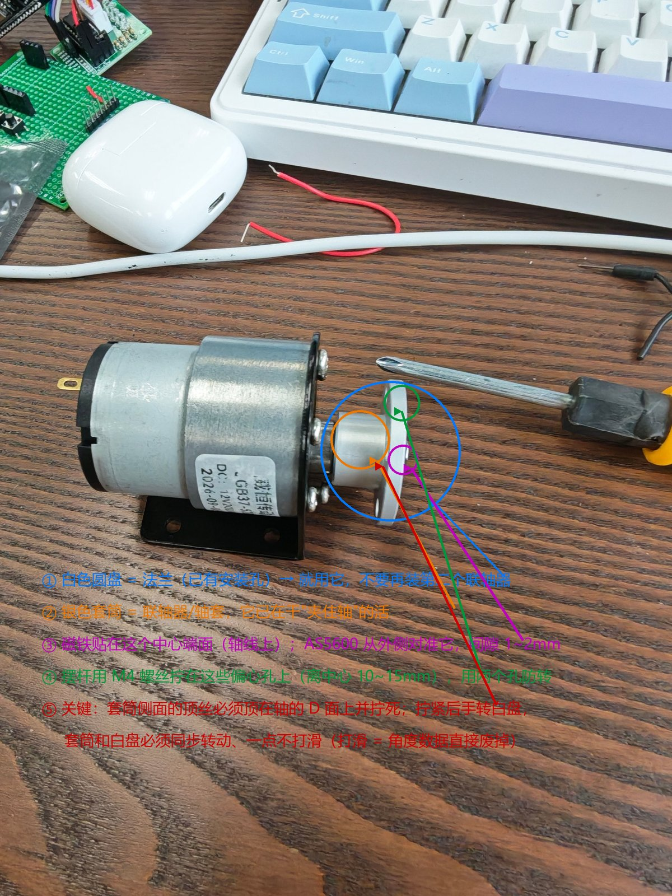
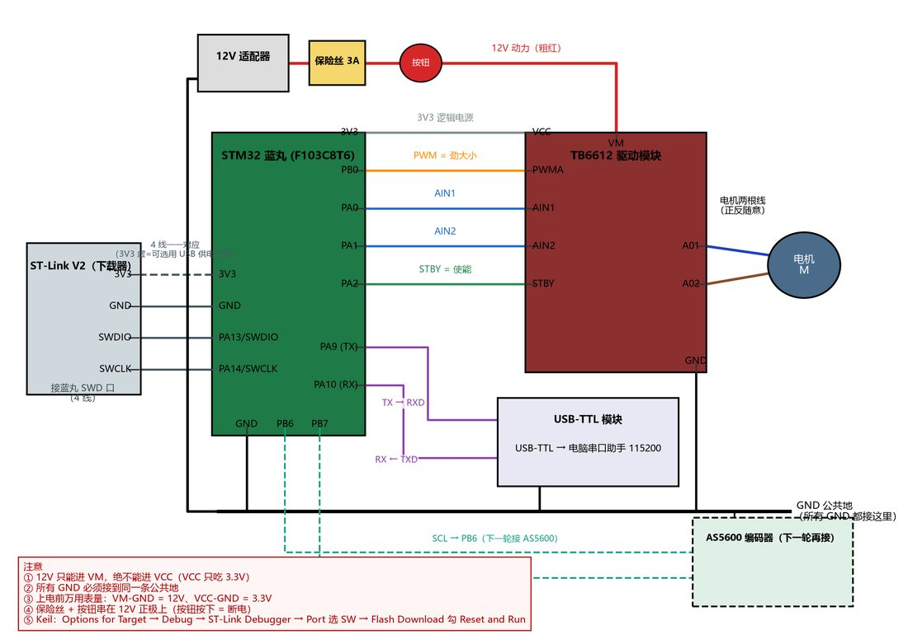
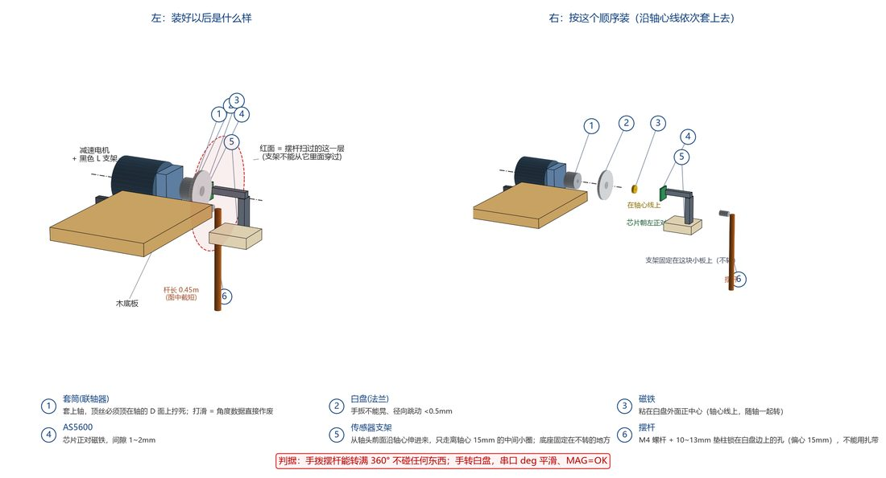
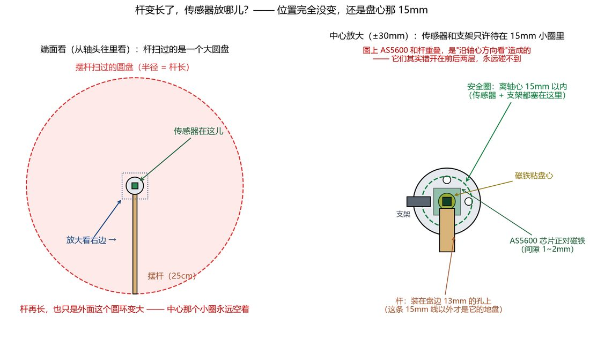
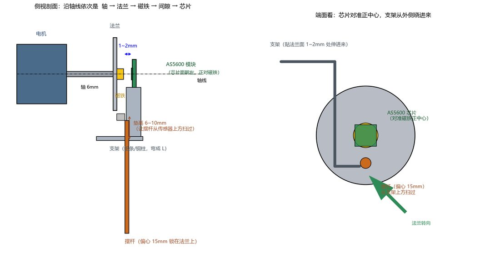
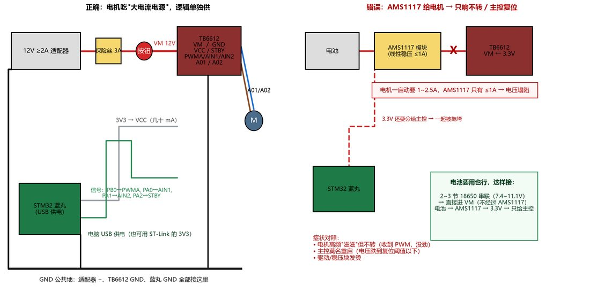
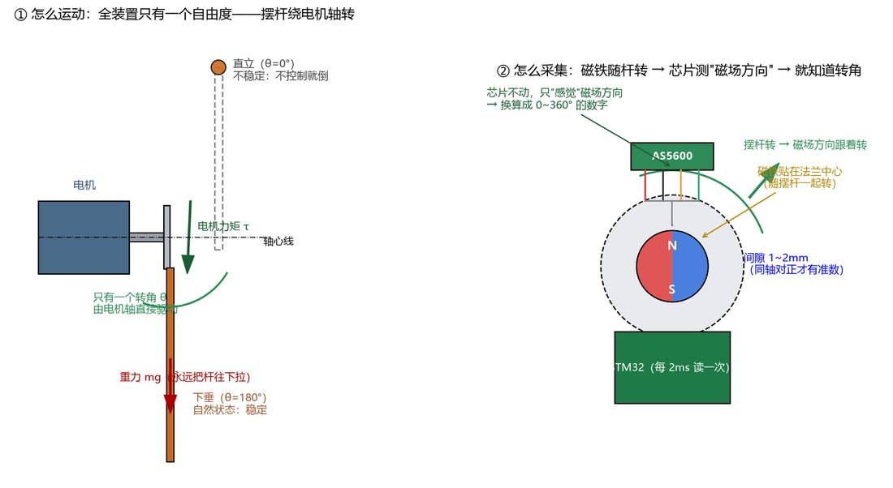
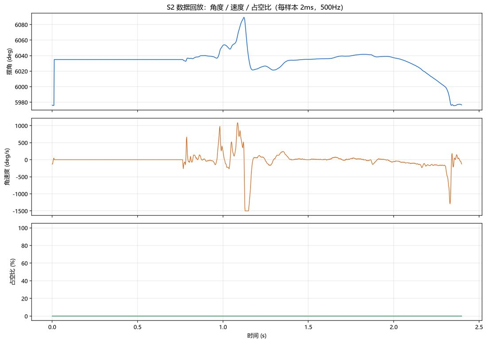
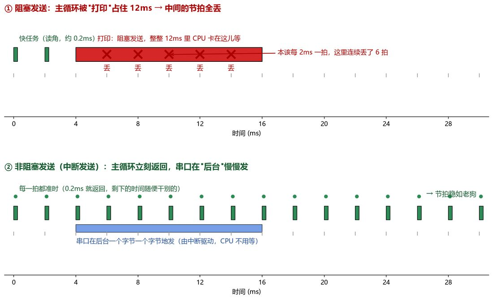

# 电机直驱倒立摆 · STM32 自动平衡控制系统

> YF105 实验室 25 级招新作品。**12V 减速电机经联轴器与法兰直接驱动摆杆，基座固定——没有小车，也没有导轨。**
> 状态只有两个：摆角 θ、角速度 ω；控制量是电机力矩。



---

## 一句话介绍

STM32F103 + AS5600 磁编码器 + TB6612 驱动，**2 ms 硬节拍（500 Hz）闭环**。
实物打通了「驱动 / 采集 / 2 ms 采样 / 角度链 / 数据记录」（S1~S2 实机验收）；
平衡控制、能量起摆与安全监控在与实物**同结构**的 2 状态仿真平台上完成设计与验证。**实物平衡闭环（S3）尚未跑通**，这一点在报告与文档里都是明确写清的。

## 目录结构

```
firmware/                STM32 固件（Keil / MDK-ARM）
├── inc/                 头文件（接口）——hal / drivers / core / app 四层
├── src/                 实现文件（.c），与 inc/ 同层同名
├── docs/                模块地图、Keil 挂载步骤、与原单文件版的等价性对照
├── _build/              离线编译检查脚本（不需要 Keil 也能验证能否编译）
└── legacy_S1/           原单文件版 app_angle.c(v12) 与 S1 遗留版 app_motor.c（只读对照，勿编译）

sim/                     Python 仿真（与实物同结构：2 状态 + 摩擦死区 + 量化噪声）
├── sim_direct.py        仿真主程序（S1~S9 场景）
├── pc_test/             角度链回归测试：C 模块 vs 独立 Python 模型
├── results_direct/      CSV + metrics_direct.json
├── figs/                D1~D9 结果图
└── viz/                 可直接用浏览器打开的可视化动画

docs/                    设计报告（docx / pdf）、答辩讲稿、速查卡、演示脚本卡
tools/                   接线图 / 装配图 / 三维分解图的绘制脚本与成图
assets/rig/              实物照片与装配示意（压缩版，原图在本地工作目录）
```

## 实物与装配

| 接线与原理 | 正确组装 | 长杆传感器布置 |
|---|---|---|
|  |  |  |

| AS5600 安装位置 | 供电接线对照 | 运动与采集原理 |
|---|---|---|
|  |  |  |

实测数据记录与实验对比：

| 角度链 dump（S2） | 阻塞 vs 非阻塞发送 |
|---|---|
|  |  |

## 硬件与接线

| 模块 | 型号 / 参数 |
|---|---|
| 主控 | STM32F103C8T6（蓝丸），HCLK 72 MHz |
| 角度 | AS5600 磁编码器，I2C（PB6/PB7），12 bit 绝对角度 |
| 驱动 | TB6612（PWM: PB0 / TIM3_CH3，方向 AIN1/AIN2: PA0/PA1，STBY: PA2） |
| 电机 | 12V 减速电机（JGB37-520） |
| 串口 | USART1 115200 8N1（PA9/PA10），打印走轮询、命令走中断 |

在 Keil 里挂载只需三步：把 `firmware/src` 下 8 个 `.c` 加入一个 Group、
**把 `firmware/inc` 加进 Include Paths**、在 CubeMX 生成的 `main.c` 的 USER CODE 区调用
`app_angle_init()` 与 `app_angle_loop()`。
逐步说明（含期望的开机 banner 文本）见 [`firmware/docs/main.md`](firmware/docs/main.md)。

## 关键结果

| 项 | 数值 |
|---|---|
| 采样节拍 | 2 ms（500 Hz），实测 dt = 2000 ± 2 µs、零漏拍 |
| 电机 PWM | 20 kHz（TIM3，ARR = 3599） |
| 角度分辨率 | 0.088°/count（12 bit），\|B\| ≈ 1000 |
| 核心矛盾 | 摆杆重力矩 ≈ 11.8 mN·m，减速箱静摩擦 ≈ 5 mN·m（占 40%+）→ **摩擦死区** |
| 纯 PD / LQR | 10° 起步都卡在 ±6.5°（压不过静摩擦，settle = ∞） |
| PID | 2° 起步 1.20 s 收敛到 −0.51°；10° 起步 0.52 s 进 ±3° 带，随后 ±2° 极限环 |
| 能量起摆 | 从下垂位泵到直立，17.98 s 稳定（稳态残差约 −0.05°） |
| 安全监控 | 传感器断连 38 ms / 占空比饱和 58 ms / 看门狗 20 ms 内急停 |

## 怎么复现

**固件能否编译**（不需要 Keil，用 STM32CubeIDE 自带的 arm-none-eabi-gcc）：

```powershell
# 见 firmware/_build/compile_check.ps1（内含编译器与 HAL 头文件路径）
& firmware\_build\compile_check.ps1 -SrcDir firmware -Name check
```

**仿真结果**：

```powershell
python sim\sim_direct.py          # 重跑 S1~S9，输出 results_direct\ 与 metrics_direct.json
```

**角度链回归测试**（C 模块 vs 独立 Python 语义模型，逐拍逐字段比对）：

```powershell
python sim\pc_test\test_fw_angle_core.py
```

> 测试会用本机的 x86 gcc 把 `firmware/src/core/angle_core.c` 编成动态库再与 Python 模型对拍，
> 判据是「角度相对 1e-5、速度 ±1 LSB」。**注意不能用 arm-none-eabi-gcc**：它产出 ARM 机器码，
> `ctypes` 加载会报 WinError 193。

## 设计报告

- [`docs/电机直驱倒立摆自动平衡控制系统-设计报告-曾庆源.pdf`](docs/电机直驱倒立摆自动平衡控制系统-设计报告-曾庆源.pdf)（20 页，含方案论证、模型推导、仿真与测试）
- 答辩讲稿 / 面试速查卡 / 现场演示脚本卡 / 三个故事详解 —— 同在 [`docs/`](docs/)

## 诚实边界

- 实物只完成到 S1~S2（驱动、采集、2 ms 节拍、角度链、数据记录），**平衡闭环 S3 未跑通**；
- 报告中的控制算法结果均为**仿真验证**结果，作为移植到实物的设计依据；
- 仿真里「强扰动后自动重捕获」曾一度失败，已定位为**判据用了连展角**（转两圈后累积上千度，
  `|θ| < 45°` 永不成立）——改为折回角并加滞回后降级 0.29 s 内重捕获。详见
  [`sim/仿真数字复核报告-2026-10-07.md`](sim/仿真数字复核报告-2026-10-07.md)。

## 参考

- 本项目固件为 S2 阶段产物，S3（让摆杆站住）仍在推进；
- CubeMX 配置清单见 [`firmware/legacy_S1/CubeMX_配置清单.md`](firmware/legacy_S1/CubeMX_配置清单.md)；
- 接线表见 [`firmware/legacy_S1/接线表.md`](firmware/legacy_S1/接线表.md)。
